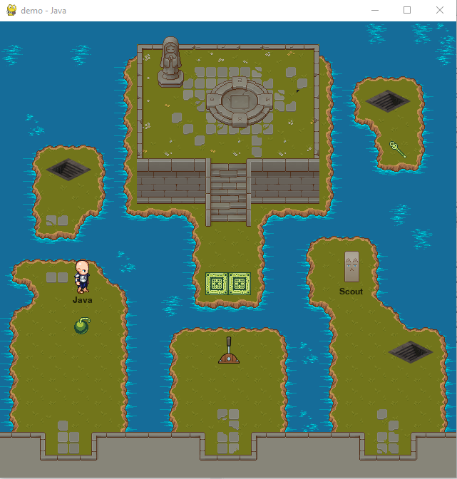
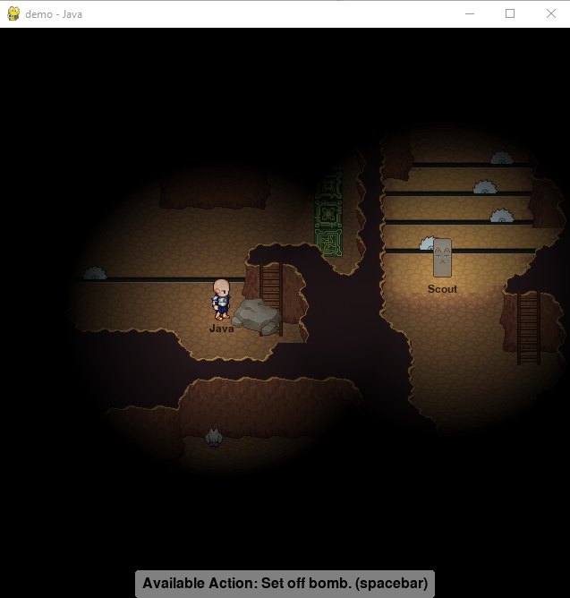

[ **ABOUT** | [SETUP and RUN](SETUP.md) | [CREATE A GAME](CREATE.md) | [TUTORIALS](TUTORIALS.md) | [CONTRIBUTING](CONTRIBUTING.md) ]

# !!! How to use cutscene system, DOCUMENTATION:
Dialouge for cutscenes are stored in src/gamename/dialog
They are json files, which look like this:
```
{
    "1": [
      "lock% Good mroning, I hope you had a pleasant day?",
      "Personally, I'm not too pleased with all the work I have to do.",
      "Milk toast is a fine breakfast choice.",
      "move% 289 158 100"
    ],
    "2": [
        "Actually, now that I think about it, what even is milk toast?",
        "unlock% I guess I'll never know..."
    ]
}
```

* Each number indicates a different person speaking, or the same person speaking at a different location.
* When the dialog runs, the game will go through all lines in order.
* To create a dialog tigger in TILED, used the square tool and set its type to "dialog". Under custom properties, create a new field called "id" and set it to a number. This will correspond to the number in the json array which stores what to say.

There are currently 3 special commands to use.
* lock% will disable mouse clicks. Use it at the beginning of any cutscene. Do not use it by itself in 1 line. Always pair it with dialog to save space.
* unlock% will enable mouse clicks. Use it at end of a cutscene to change to normal gameplay.
* you can use move% at the end of a number array to move the character. The first digit represents the X-coord. Second is y-coord. Third is speed. 100 is roughly the default speed, so use that when in doubt. MOVE% CAN ONLY BE USED BY ITSELF IN ONE LINE! IT WILL END THE DIALOG, even if you have more dialog after it. ALWAYS PLACE IT AT THE END OF THE ARRAY.


# LAN-Caster - About

LAN-Caster is a simple game engine for game development. Key features of LAN-Caster are:

  * Implemented in Python 3;
  * Support for importing 2D Orthogonal tile maps created with [Tiled](http://mapeditor.org);
  * Multiplayer support over Local Area Network (LAN) and experimental support for playing over internet;
  * Extendable classes for client and server that implement game logic, network messaging, rendering and user input handling;
  * Extensive code level comments;
  * Demo Game and Game Engine Tester which demonstrate how to use and extend LAN-Caster to make your own game;
  * Tutorial Videos which explain most aspects of LAN-Caster.

## Examples From Demo Game




